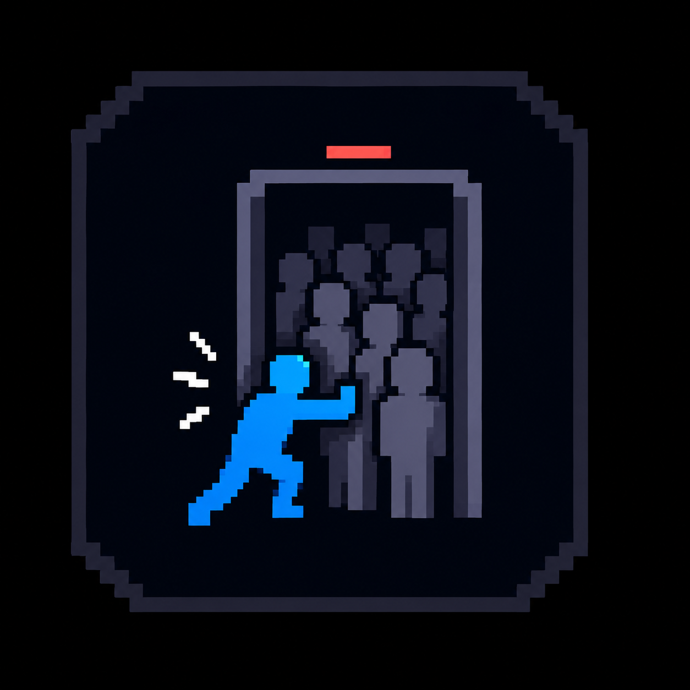

<div align="center">

# Auto Rejoin



**Automatically join a Minecraft server as soon as a slot becomes available.**

[](https://www.minecraft.net/)
[](https://fabricmc.net/)
[](https://adoptium.net/)
[](LICENSE)

</div>

## Overview

Auto Rejoin is a client-side Fabric mod for Minecraft 26.2. It periodically
checks a server's status using a lightweight status ping and connects
automatically when the server is no longer full.

It does not repeatedly open real login connections while waiting. The mod
performs a status query, waits for an available slot, and then makes one
normal connection attempt. If that attempt fails because another player took
the slot first, checking resumes automatically.

> **Important:** Use a sensible interval for the server you are checking.
> Very aggressive polling may trigger server-side rate limits or firewalls.

## Features

- Lightweight server status pings while waiting.
- Automatic connection when a slot becomes available.
- Automatic retry after a race-condition connection failure.
- Automatic backoff when the server is unavailable, up to 30 seconds.
- In-game notifications and a success sound.
- `/autorejoin` commands for starting and stopping a watcher.
- F6 keybind to toggle the last configured watcher.
- **Force Enter** button in the multiplayer screen for the selected server.
- English and Italian translations.
- Client-only: no server-side installation is required.

## Requirements

- Minecraft **26.2**
- Fabric Loader **0.19.0 or newer**
- Fabric API for Minecraft 26.2
- Java **25 or newer**

## Installation

1. Install Fabric Loader for Minecraft 26.2.
2. Install the matching Fabric API version.
3. Download the latest `autorejoin-<version>.jar` from
   [Releases](../../releases).
4. Put the mod JAR in your Minecraft `mods` folder.
5. Launch Minecraft with the Fabric profile.

The mod is client-side only. Fabric API is still required by the project.

## Usage

### Commands

Start watching a server:

```text
/autorejoin start <address> [port] [intervalSeconds]
```

Examples:

```text
/autorejoin start play.example.net
/autorejoin start play.example.net 25565 10
```

Stop the active watcher:

```text
/autorejoin stop
```

The default interval is one second and the minimum is one second. Increase it
for servers with strict anti-bot, anti-spam, or firewall rules.

### F6 toggle

Press **F6** to toggle the watcher for the last server configured through the
command or the multiplayer menu. The key can be changed under:

`Options > Controls > Key Binds > Auto Rejoin`

If no server has been configured during the current session, the mod explains
how to configure one first.

### Force Enter

The multiplayer screen includes a **Force Enter** button:

1. Select a server in the multiplayer list.
2. Press **Force Enter**.
3. Auto Rejoin starts checking that server.
4. The mod connects as soon as a slot is detected.

## Building from source

Clone the repository and run the Gradle wrapper:

```bash
git clone https://github.com/<your-account>/AutoRejoin.git
cd AutoRejoin
./gradlew build
```

On Windows:

```powershell
.\gradlew.bat build
```

The compiled mod is written to:

```text
build/libs/autorejoin-1.0.0.jar
```

The project uses official Mojang mappings for Minecraft 26.2. Gradle will
download the required Minecraft, Fabric, and Loom dependencies on the first
build.

## Project layout

```text
src/main/java/
  com/example/autorejoin/
    AutoRejoinMod.java          Main client entrypoint and commands
    ServerPinger.java            Lightweight status-ping implementation
    mixin/                       Multiplayer screen integration
src/main/resources/
  fabric.mod.json                Fabric metadata
  autorejoin.mixins.json         Mixin configuration
  assets/autorejoin/             Icon and translations
```

## Responsible use

Auto Rejoin is intended for personal convenience, not for bypassing server
rules or overwhelming server infrastructure. Always follow the rules of the
server you use. Choose an interval appropriate for the server and stop the
watcher when it is no longer needed.

## Troubleshooting

### The build cannot find Java 25

Check that Java 25 is installed and that `JAVA_HOME` points to the JDK 25
installation. The project intentionally targets Java 25 because Minecraft 26.2
requires it.

### The multiplayer button does not compile

The button is implemented with a mixin and can be sensitive to upstream
Minecraft GUI changes. Check the names of the multiplayer screen and server
list field against the Minecraft 26.2 mappings. The command-based interface
does not depend on the multiplayer-screen mixin.

### The mod does not connect

Confirm that the server address and port are correct, the server is reachable,
and that the server allows the client to join. A status ping is not a
guarantee that a slot will still be available when the real connection starts.

## Contributing

Issues and pull requests are welcome. Please include the Minecraft version,
Fabric Loader version, relevant log output, and reproducible steps when
reporting a problem.

## License

Auto Rejoin is released under the [MIT License](LICENSE).
